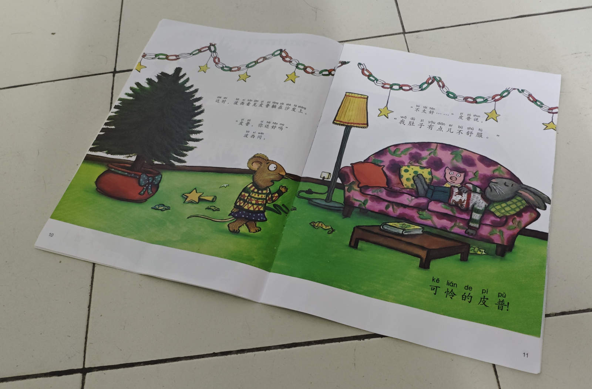
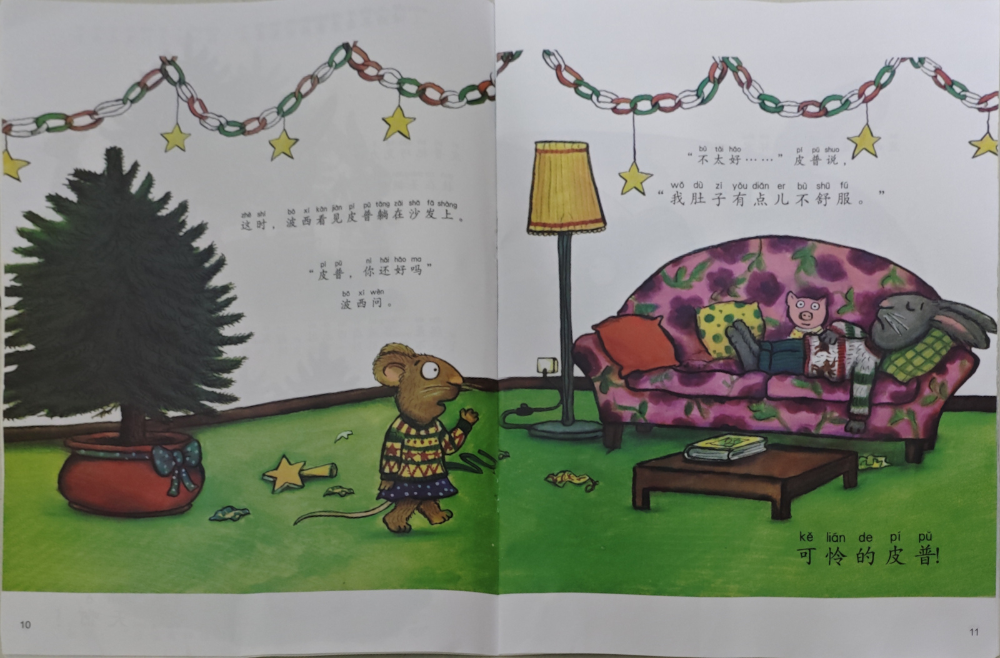
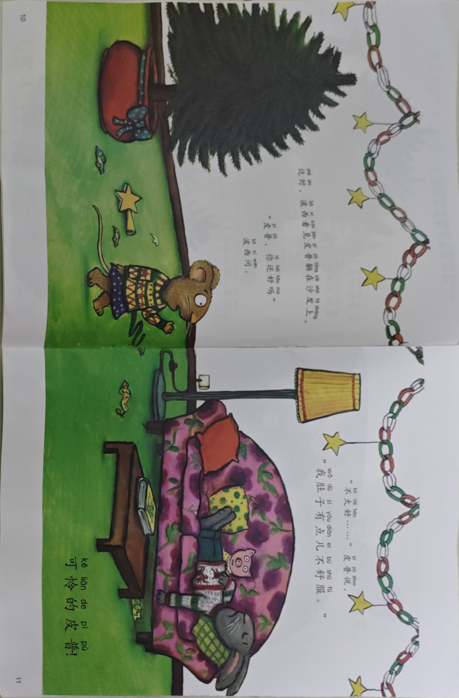

# 任务书-书页展平

---

[toc]

---

## 简介

用 Python 实现一个书页纠偏、展平函数。

给定一张照片，识别这幅图片中的书页，把它旋转、拉伸为长方形，输出处理后的书页。

## 函数签名

```python
def correct_paper(image_bytes: bytes) -> bytes
```

或其异步形式：

```python
async def correct_paper(image_bytes: bytes) -> bytes
```

## 参数

- `image_bytes` (bytes)：要处理的照片文件（字节），如：

    

## 返回值

处理后的图片文件（文件格式与输入相同），如：



对输出的长宽比不作要求，也就是说，输出这个也是可以的：


但是要确保图中的字清晰可认，因此建议输出的跟原照片尺寸一样吧。

对输出的旋转方向不作要求，也就是说，输出这个也是可以的：




## 输入特征

- 输入图片大小不超过 1600×1200 像素。
- 图片格式：JPG / PNG

## 要求

- Python 版本：3.12
- 允许使用第三方库（如 OpenCV、Pillow、numpy 等）
- 不能本地部署大模型
- 性能：在单核 CPU 上：

    - 对大量输入的均摊运行时间 $\leq 0.4$ 秒。

    - 单次调用的最大运行时间 $\leq 1$ 秒。

## 调用示例

会以下面这样的代码调用你写的函数。

```python
import os
os.mkdir("output")

image_paths = [
    "image_1.png",
    "image_2.png",
    ...,
    "image_9999.png"
]

for image_path in image_paths:
    # 读取文件字节
    with open(image_path, mode="rb") as file:
        image_bytes = file.read()

    # 调用处
    corrected_image_bytes = correct_paper(image_bytes)

    # 写入文件
    with open(f"output/{image_path}", mode="wb") as file:
        file.write(corrected_image_bytes)

```

## 评测

克隆本仓库：

```bash
git clone https://github.com/Jerry-Wu-GitHub/page_flatten_test.git
```

安装依赖：

```bash
cd page_flatten_test
python -m pip install -r requirements.txt
```

在 [`input`](input) 文件夹里有三组测试用例。对于每组测试用例：有4张左右的照片，拍的书本页面是一样的，但是角度不同。
- group1: 简单测试
- group2: 书页微微隆起
- group3: 书页边缘略有不全

理论上来说，每组内的4张图片经过 flatten 的结果应该是一样的，我用图片的 average hash 值（256位的0-1数组，即长度为32的字节串）的汉明距离来量化图片之间的相似度。这种哈希是一种局部敏感哈希（相似的图片的哈希结果也相似），且对图片的长宽比不敏感。具体的哈希细节你拿 [`image_hash.py`](image_hash.py) 可以问问AI。

在 [`config.py`](config.py) 里定义了 `CHALLENGE_HASH_DIFF_THRESHOLD` 和 `BASE_HASH_DIFF_THRESHOLD` ，你的目标是：同一组内的图片两两之间的 average hash 的汉明距离占总比特数的比例不超过 `BASE_HASH_DIFF_THRESHOLD` 。如果能再好一点，不超过 `CHALLENGE_HASH_DIFF_THRESHOLD` 。

你的程序应该可以放在 [`book_flatten`](book_flatten) 文件夹内，记得导出你的 `correct_paper` 函数：

```python
# book_flatten/__init__.py
# 导入、导出 correct_paper 函数
```

然后，你可以运行 [`main.py`](main.py) ：

```bash
python main.py
```

就会输出测试结果：

```
CHALLENGE_HASH_DIFF_BYTES=20.48
BASE_HASH_DIFF_BYTES=38.4

==== Test group1 ====

处理图片 01.jpg ：耗时 0.33 秒
处理图片 02.jpg ：耗时 0.46 秒
处理图片 03.jpg ：耗时 0.34 秒
处理图片 04.jpg ：耗时 0.23 秒
平均耗时 0.34 秒
比较距离：01.jpg 与 02.jpg ：9
比较距离：01.jpg 与 03.jpg ：4
比较距离：01.jpg 与 04.jpg ：39
比较距离：02.jpg 与 03.jpg ：11
比较距离：02.jpg 与 04.jpg ：34
比较距离：03.jpg 与 04.jpg ：41

==== Test group2 ====

处理图片 01.jpg ：耗时 0.16 秒
处理图片 02.jpg ：耗时 0.16 秒
处理图片 03.jpg ：耗时 0.16 秒
处理图片 04.jpg ：耗时 0.15 秒
平均耗时 0.16 秒
比较距离：01.jpg 与 02.jpg ：25
比较距离：01.jpg 与 03.jpg ：21
比较距离：01.jpg 与 04.jpg ：29
比较距离：02.jpg 与 03.jpg ：38
比较距离：02.jpg 与 04.jpg ：48
比较距离：03.jpg 与 04.jpg ：38

==== Test group3 ====

处理图片 01.jpg ：耗时 0.22 秒
处理图片 02.jpg ：耗时 0.18 秒
处理图片 03.jpg ：耗时 0.17 秒
处理图片 04.jpg ：耗时 0.16 秒
平均耗时 0.18 秒
比较距离：01.jpg 与 02.jpg ：88
比较距离：01.jpg 与 03.jpg ：67
比较距离：01.jpg 与 04.jpg ：63
比较距离：02.jpg 与 03.jpg ：93
比较距离：02.jpg 与 04.jpg ：89
比较距离：03.jpg 与 04.jpg ：64
```

## 异常处理

如果照片里识别不到书页，请你引发一个异常。

## 提交方式

自己创建一个 GitHub 仓库，包含 [`book_flatten`](book_flatten) 文件夹内的文件，README 里写清楚运行耗时、效果图、调用方式等。